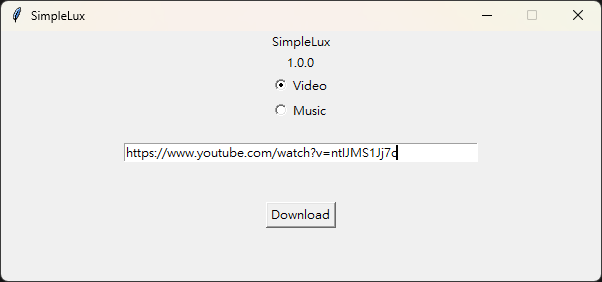

# 🚀 SimpleLux

English | [中文](README-zh.md)

This is a multi-platform video download tool based on [iawia002/lux](https://github.com/iawia002/lux). It currently focuses on downloading videos from **YouTube**. The tool offers two download formats: video (.mp4) and music (.mp3), and features a simple graphical user interface.

This project is a personal side project, released as open-source for learning and use, and is not intended for any commercial purpose.

### ✨ Key Features

  * Supports **YouTube** video and music downloads.
  * Option to download in `.mp4` video format.
  * Option to download in `.mp3` music format (with automatic conversion).
  * Simple and easy-to-use graphical user interface.
  * Open-source, welcoming to learners and contributors.

-----

## 🛠️ Installation Guide

SimpleLux offers two installation methods. You can choose the one that suits you best.

### Method 1: Compile from Source

This is the recommended method as it automatically installs all necessary dependencies and compiles the program.

#### Prerequisites

  * [**scoop**](https://scoop.sh/): A Windows package manager used to install `ffmpeg` and `go`.
  * **ffmpeg**: For video conversion.
  * **go**: For compiling Lux and SimpleLux.
  * **Git**: For cloning the lux project.
  * **Python**: For executing scripts like `uv`.

#### Installation Steps

1.  Clone this project.
2.  Run `install.bat` from the project directory.

**※ Troubleshooting Scoop Installation**

If you encounter an `Invoke-Expression` error during Scoop installation on an older Windows version, you can resolve it by installing **PowerShell 7**:

```bash
winget install Microsoft.PowerShell
```

After installation, use the following command to install Scoop:

```bash
pwsh Invoke-RestMethod -Uri https://get.scoop.sh | Invoke-Expression
```

Then, you can re-run `install.bat`.

Once `install.bat` is complete, SimpleLux will start automatically, and a shortcut will be created on your Windows user desktop for easy access.

### Method 2: Use Pre-compiled Executable

This version does not require compilation, but you must manually install `ffmpeg` and configure environment variables.

1.  **Install ffmpeg**
    Scoop is still a convenient way to install it:
    ```bash
    scoop install ffmpeg
    ```
2.  **Unzip and Run**
    Unzip the downloaded file and run `SimpleLux.exe` to use the tool.

-----

## ⚙️ Configuration File (config.json)

SimpleLux uses a `config.json` file for some basic settings. The default content is as follows:

```json
{
    "name": "SimpleLux",
    "version": "1.0.0",
    "window_width": 600,
    "window_height": 250,
    "lux_path": "lux.exe",
    "ffmpeg_path": "ffmpeg",
    "output_path": "outputs"
}
```

  * `name`: The title of the application window.
  * `version`: The application version number (currently has no practical effect).
  * `window_width`: The width of the window (in pixels).
  * `window_height`: The height of the window (in pixels).
  * `lux_path`: The path to the Lux executable.
  * `ffmpeg_path`: The path to the FFMPEG executable. If you installed it with Scoop and have set the environment variables, simply `"ffmpeg"` will suffice.
  * `output_path`: The folder name where downloaded files will be saved.

-----

## 🖥️ User Guide

### Starting the Program

  * **From Source**: Run the SimpleLux shortcut on your desktop.
  * **Pre-compiled Version**: Run `SimpleLux.exe` directly.

### Operation Flow

1.  **Select Download Format**
    In the application window, select your desired download format: **Video** or **Music**.

2.  **Paste YouTube URL**
    Use `Ctrl + V` to paste a YouTube video URL into the text box. Please note that it currently only supports clean URLs like `https://www.youtube.com/watch?v=ntIJMS1Jj7c`. You should manually remove any extra query parameters after the `&`.

3.  **Click the Download Button**
    Click the **Download** button to start the process.

      - The program will automatically call Lux to perform the download.
      - If you selected the **Music** format, FFMPEG will be called automatically after the download is complete to convert the file to `.mp3`.
      - *Note*: Some video downloads might be blocked by Google, causing the progress to stall. You can try changing your IP or using a proxy to bypass this restriction.

4.  **Completion**
    After the download and conversion are finished, the folder containing the downloaded files will open automatically, giving you access to your YouTube media files.



-----

## 🤝 How to Contribute

If you have any suggestions or find bugs, feel free to open an **Issue** or submit a **Pull Request**.

## 📞 Contact

For any other questions, please reach out via GitHub Issues.